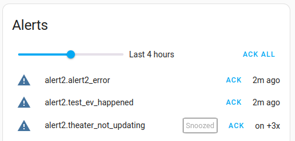
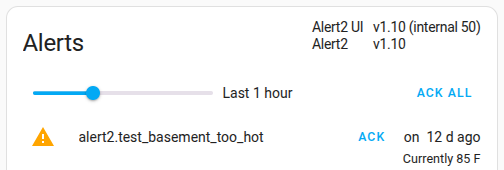
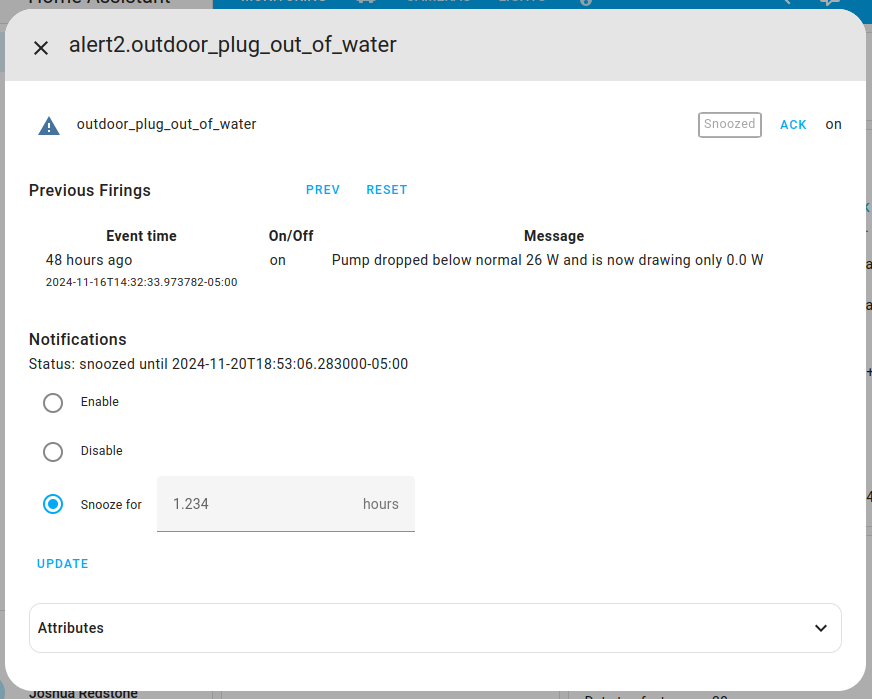
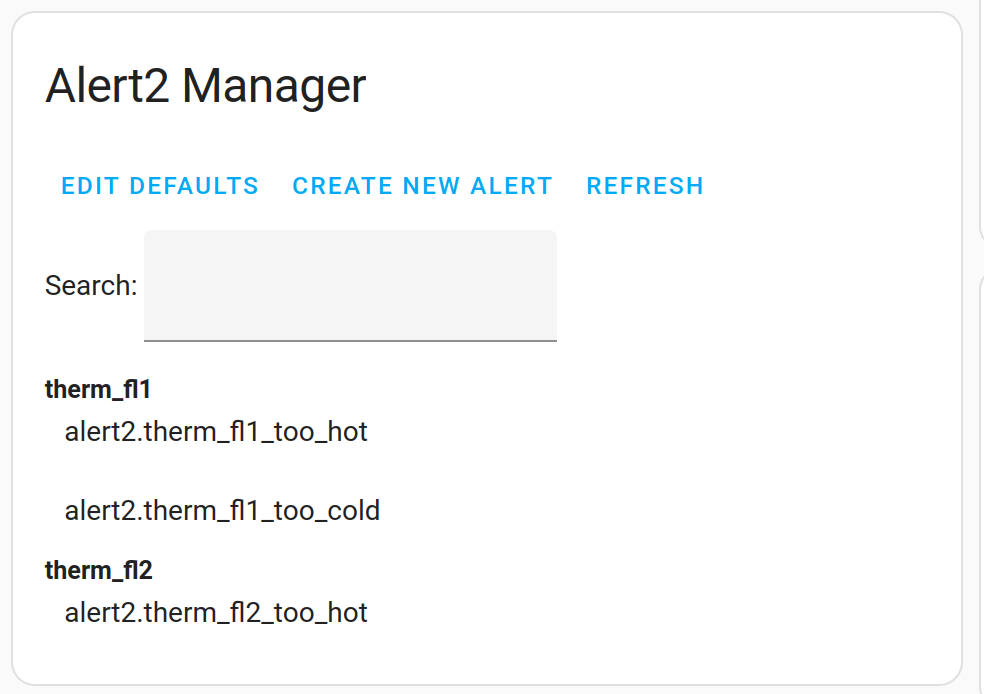
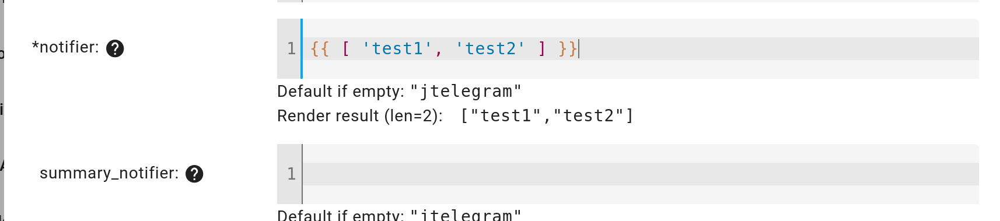

<!-- ~/tmp/general-env/bin/grip -b ~/tmp/hass-alert2-ui/README.md 6420 -->

<!--  -->

# Alert2 UI

This repository contains two Lovelace cards to display and interact with [Alert2](https://github.com/redstone99/hass-alert2) alerts.  It also enhances the information shown in the "more-info" dialog when viewing Alert2 entities in entity cards. We recommend first installing [Alert2](https://github.com/redstone99/hass-alert2).

## Install

HACS install (recommended)

1. If HACS is not installed, follow HACS installation and configuration instructions at https://hacs.xyz/.

1. Click the button below

    

    or visit the HACS pane and add `https://github.com/redstone99/hass-alert2-ui.git` as a custom repository of type "Dashboard" by following [these instructions](https://hacs.xyz/docs/faq/custom_repositories/).

1. The UI should now show the "Alert2 UI" doc page in HACS. Click the "Download" button (bottom right of screen) to download the UI module.

    If for some reason adding the repository did not take you to the "Alert2 UI" doc page, you may need to click again on the HACS pane, search for "Alert2 UI" and click on it to get to the page.

1. Click "Reload" when it prompts you to reload your browser.

Manual install

1. Download the `Source code (zip)` link from the repository [release section](https://github.com/redstone99/hass-alert2-ui/releases) under "Assets" and unzip it.

   We do not recommend downloading directly from the `main` branch.

1. Create the directory `www` in your Home Assistant configuration directory if it doesn't already exist.

   Your configuration directory is the directory with `configuration.yaml`. It is commonly `/config`, or may be something like `~/.home-assistant/` for Linux installations.
   
1. Copy `alert2.js` from unzipped file into the directory `www` in your config.

   Your config directory should look similar to this after copying:
                   
        <config dir>/configuration.yaml
        <config dir>/www/alert2.js
        <config dir>/custom_components/alert2/__init__.py
        <config dir>/custom_components/alert2/sensor.py
         ... etc...

Upgrading

After upgrading Alert2 UI, it can take time for the browser or HA companion app to update alert2.js.  To speed that up:

* On the web, try reloading the page a few times and also "Clear cookies & site data".

* On the Android HA companion app, try going to System Settings -> Apps -> Home Assistant -> Storage & cache and clicking "Clear cache".  Then in the HA app, click on the vertical dots at the top and click on "Reload resources".  You may need to wait a few seconds and click "Reload resources" twice.

Next:

1. If you installed Alert2 UI through HACS and configure dashboards via the UI (i.e., Lovelace in `storage` mode), then `alert2.js` should be loaded into HA automatically.

    Otherwise:

    If you configure dashboards via yaml (Lovelace in `yaml` mode), you need to add an entry for `alert2.js` in the resources subsection of the lovelace section of your `configuration.yaml`. If you installed via HACS, this will look like (in bold):

    <pre>lovelace:
      mode: yaml
      resources:
        <b>- url: /hacsfiles/hass-alert2-ui/alert2.js</b>
          <b>type: module</b>
        ...</pre>

    or if you installed manually directly into the `www` directory, it will look like:

    <pre>lovelace:
      mode: yaml
      resources:
        <b>- url: /local/alert2.js</b>
          <b>type: module</b>
        ...</pre>

    Lastly, if you installed Alert2 UI manually and configure dashboards via the UI, then enable "Advanced mode" in your user profile, then click on Settings -> Dashboards -> Resources.  "Resources" may appear only in the triple vertical dots on the upper right of the dashboards page. Click on "Add Resource" to add `alert2.js`.

1. `alert2.js` defines two custom UI cards called `custom:alert2-overview` and `custom:alert2-manager`. If you configure dashboards via the UI, start editing a dashboard, then click on "Add Card" (or the "+" icon), then manually add a card of type `custom:alert2-overview`.

    If you're using yaml to specify a dashboard, you can add the Alert2 overview card to your dashboard by adding it to the list of cards in a view, like (in bold):

    <pre>views:
    - title: Monitoring
      name: Example
      cards:
      <b>- type: "custom:alert2-overview"</b>
      <b>- type: "custom:alert2-manager"</b>
      - type: entities
        ...</pre>

1. Restart HomeAssistant and reload the UI

## Overview card

The `alert2-overview` Lovelace card lists recently active Alert2 alerts, as well as snoozed or disabled alerts.  A slider at the top of the card controls the time window covered. Each line shows the status of the alert, including when it last fired, how many times it fired since the last notification, and whether it has been ack'ed, snoozed or disabled.  Each alert will show an "ACK" button if it hasn't been acked already. The button "ACK ALL" will ack all alerts, not just the ones displayed.

Note - `alert2-overview` will show currently firing old Alert-1 alerts, but it will not show recent activity for the old alerts.

The order of displayed alerts is:
1. Alerts currently on and unacked, most recent first
1. Alerts currently off and unacked, most recent first. This includes event alerts.
1. Alerts currently on and acked, most recent first
1. Alerts currently off and acked, most recent first. This includes event alerts.

For the purpose of ordering, alerts that are snoozed or disabled are treated as if acked.

If alert A is superseded by another alert that's firing, alert A will appear in UI without a badge, directly below the alert that supersedes it.

### Detailed alert info

If you click on a specific alert listed in the alert overview, a dialog pops up with detailed info on the alert and notification controls. Example:

The first line is a repeat of the alert status.

The second "Previous Firings" section lists each firing over the previous 24 hours, limited to the most recent 20 events.  The time when the alert turned on or off is listed as well as the message template text rendered when the alert fired.  The "PREV" button lets you go back further in time and "RESET" returns the listing to the firings over the past 24 hours and refreshes the listing.  You may see events listed that have time `unknown`. This are extra events inserted due to either HomeAssistant restarting or the first time an alert is created (TODO - filter these spurious events out).

The "Notifications" section lets you snooze or disable notifications. Select an option and click "Update".  The "Status" line will update dynamically.

Snoozing an alert implicitly acks it once and prevents notifications during the snooze interval.  When the interval ends you can opt to get a summary notification of any alert activity during the period. See `summary_notifier` in the [Alert2](https://github.com/redstone99/hass-alert2) docs.

Times are displayed in the browser local time zone.

### Other ways to view alerts

You may also add alert2 entities to entities cards and other cards that support entities.  If you click on an alert shown in such a situation, you'll see a popup (called a "more-info dialog") similar to the one shown above.  However, since Alert2 isn't integrated into the core HomeAssistant, that dialog will include some extra default sections like "history", but will also include the sections described above.

Finally, you can also view alert information by going to Settings -> Devices & Services -> Entities, typing "alert2." in the search box and browsing the list.  Clicking on one will popup the "more-info dialog".

## Manager card

The `alert2-manager` Lovelace card allows you to adjust default settings, create/edit/delete alerts, and search over alerts created via the UI.  The search box lets you filter UI-created alerts by the text you type. Clicking on any result will bring up a dialog that lets you edit the alert.

Any defaults adjusted via the UI override any defaults specified in your YAML config. The defaults apply to alerts created either via the UI or in your YAML config.  After adjusting defaults, you can reload the alert config to have the new defaults apply to all alerts, whether defined in YAML or via the UI.  You can reload the config by going to "Developer Tool" -> "YAML" and clicking on "Alert2".

Alert2 does not allow any two alerts created via the UI or YAML to have the same domain and name.

### Editing config fields

When editing a config field for defaults or an alert, a line will appear with "Render result", showing how Alert2 interprets what you've written.

You can also click on the config field name to show some help info, including examples of what you can enter:

Most fields are interpreted as YAML, with the exception that if you enter template characters (e.g., "{{" ), then the input is automatically quoted, to simplify typing.
